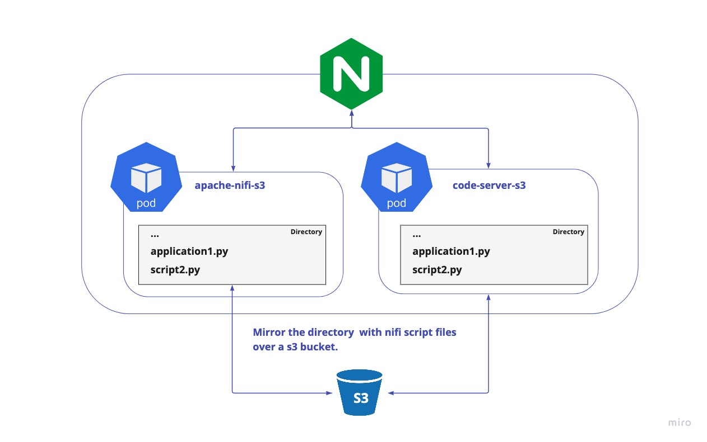

# code-server-s3

This is a image from the codercrom repository https://hub.docker.com/r/codercom/code-server.

We have added a S3 directory to mount all files whch are used in the apache/nifi repository. 

# Why

At passived.app we use the apache/nifi framework to update all our informations about the defi-apps and chains.
To edit the python files which help to update and read the blockchain informations we use the code-server to edit and test the python files used in nifi.




## Parameters


| Parameter     | Description                             |
|---------------|-----------------------------------------|
| `PASSWORD`    | The password for the code-server        |
| `PWD`           | The root directory of your workspace    |
| `ACCESS_KEY`  | Bucket Access Key                       |
| `SECRET_KEY`  | Bucket Secret Key                       |
| `BUCKET_NAME` | Bucket Name                             |
| `S3_URL`      | S3 URL of your Bucket Cloud Provider    |
| `S3_REGION`   | S3 Region of your Bucket Cloud Provider |


## Use with kubernetes


```
---
apiVersion: apps/v1
kind: StatefulSet
metadata:
  name: code-server
  namespace: default
spec:
  selector:
    matchLabels:
      app: code-server
  template:
    metadata:
      labels:
        app: code-server
    spec:
      containers:
        - securityContext:
            privileged: true
        - name: code-server
          image: passivedapp/code-server-s3
          ports:
            - name: https
              containerPort: 8080
          env:
            - name: PASSWORD
              value: <password-for-your-code-server>
            - name: PWD
              value: <your-workspace-directory>
            - name: ACCESS_KEY
              value: "<bucket-access-key>"
            - name: SECRET_KEY
              value: "<bucket-secret-key>"
            - name: BUCKET_NAME
              value: "<your-bucket-name>"
            - name: S3_URL
              value: https://s3.fr-par.scw.cloud
            - name: S3_REGION
              value: fr-par
---
apiVersion: v1
kind: Service
metadata:
  name: "code-server"
  labels:
    app-type: code-server
    app-version: "1.0.0"
    app: "code-server"
spec:
  clusterIP: None
  ports:
    - protocol: TCP
      port: 8080
      targetPort: 8080
  selector:
    app: "code-server"
```
